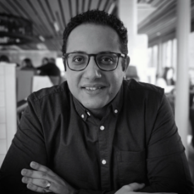

##  About RADTorch

RADTorch provides a framework of higher level classes and functions that significantly reduce the time needed for implementation of different machine and deep learning algorithms on DICOM and non-DICOM medical images.

RADTorch was built by radiologists for radiologists so they can build, test and implement state-of-the-art machine learning algorithms in minutes.

RADTorch is :

  - User-Friendly: Minimal coding required.

  - Comprehensive: Includes data analysis and visualization.

  - Backed by state-of-the-art machine learning and data visualization frameworks.

## Meet the Team

<pre style="text-indent: 10px; font-family: Roboto;">
<b>Mohamed Elbanan, MD</b>
   Founder
   Radiologist-in-training and Artificial Intelligence Advocate.
</pre>

